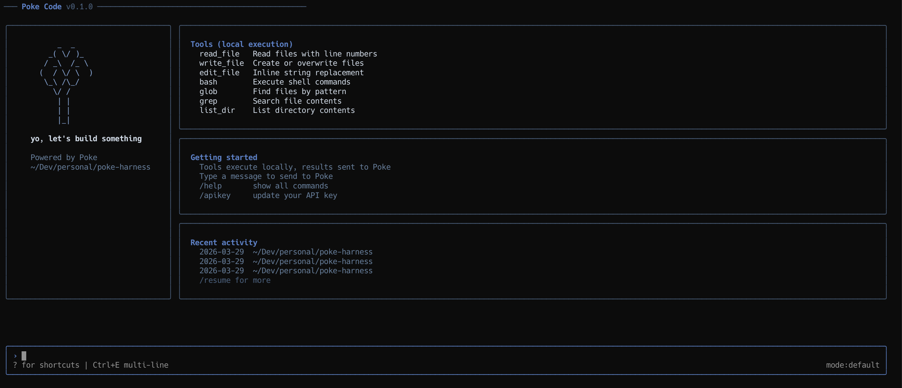

<!-- Banner -->
<p align="center">
  
</p>

<!-- Badges -->
<p align="center">
  <a href="LICENSE"></a>
  
  
  
  <a href="https://github.com/hummusonrails/poke-code/issues"></a>
</p>

<!-- One-liner -->
<p align="center">
  <strong>A Claude Code-style terminal interface for Poke AI - tools execute locally, responses stream back via iMessage.</strong>
  <br>
  <a href="#quick-start">Quick Start</a> · <a href="#usage">Usage</a> · <a href="https://github.com/hummusonrails/poke-code/issues">Report a Bug</a>
</p>

---

<p align="center">
  
</p>

## What it does

- **Execute tools locally** - read, write, edit files, run shell commands, search the web, all from your terminal with syntax highlighting and diff previews
- **Stream responses via iMessage** - polls macOS `chat.db` for Poke's replies with sub-second latency, or uses the `imsg` CLI for event-driven streaming
- **Parse three response formats** - tries XML tool calls first, falls back to bracket commands, then natural language intent detection as a last resort
- **Discover and inject skills** - automatically finds skills from `~/.claude/skills/` and marketplace plugins, matches them to your message by keyword relevance, and injects them into context
- **Load project context** - reads `POKE.md`/`CLAUDE.md`, memory files from multiple directories, project rules, and working directory listings to give Poke full codebase awareness
- **Manage permissions** - three-tier system (default, trusted, readonly) with per-tool approval prompts and "always allow" for trusted tools
- **Persist sessions** - JSONL-based session history with resume, context compaction, and session browsing
- **Guard against partial writes** - detects when iMessage splits a file write across multiple bubbles and refuses to overwrite with incomplete content
- **Render markdown** - assistant messages render with full terminal markdown (bold, code blocks, lists) via `marked-terminal`

## Quick Start

```bash
# install globally
npm install -g poke-code

# or from source
git clone https://github.com/hummusonrails/poke-code
cd poke-code
npm install && npm run build && npm link

# run the setup wizard
poke-code --init
```

The wizard walks you through:
1. Importing existing `~/.claude/` rules and memory into `~/.poke/` (renames `CLAUDE.md` to `POKE.md`)
2. Setting your Poke API key
3. Selecting your Poke iMessage contact from recent conversations

## Stack

| Layer | Tool | Notes |
|:------|:-----|:------|
| Runtime | Node.js 20+ | ES modules, strict TypeScript |
| UI | React + Ink | Full component model in the terminal |
| Database | better-sqlite3 | Readonly access to macOS `chat.db` with WAL mode |
| Messaging | imsg CLI | Direct iMessage send, bypasses API for large payloads |
| Parsing | 3-tier fallback | XML `<tool_call>`, bracket `[read]`, natural language intent |
| Highlighting | cli-highlight + chalk | Syntax coloring for 20+ languages on file reads |
| Diffing | diff | Colored inline diffs on every file edit |
| Markdown | marked + marked-terminal | Rich terminal rendering for assistant messages |

<details>
<summary><strong>Prerequisites</strong></summary>

- **Node.js 20+** - [install via nvm](https://github.com/nvm-sh/nvm)
- **macOS** - required for iMessage integration
- **Full Disk Access** - grant to your terminal app in System Settings > Privacy & Security > Full Disk Access
- **Poke account** - get an API key from [poke.com/kitchen](https://poke.com/kitchen)
- **imsg CLI** (optional) - `brew install steipete/tap/imsg` for faster message delivery

</details>

## Usage

```bash
# interactive mode
poke-code

# one-shot message
poke-code "explain what this codebase does"

# resume last session
poke-code --continue

# resume specific session
poke-code --resume <session-id>

# trusted mode (no permission prompts)
poke-code --permission-mode trusted

# readonly mode (no writes allowed)
poke-code --permission-mode readonly
```

### Tools

All tools execute locally in your terminal. Results are sent back to Poke for context.

| Tool | Permission | Description |
|:-----|:-----------|:------------|
| `read_file` | Auto | Read files with line numbers and syntax highlighting |
| `write_file` | Ask | Create or overwrite files with partial-write guard |
| `edit_file` | Ask | Inline string replacement with diff preview |
| `bash` | Ask | Execute shell commands with configurable timeout |
| `glob` | Auto | Find files by glob pattern |
| `grep` | Auto | Search file contents with regex and file type filtering |
| `list_dir` | Auto | List directory contents |
| `web_search` | Auto | Search the web via DuckDuckGo |
| `web_fetch` | Auto | Fetch and extract text from web pages |

Read-only tools run in parallel (up to 5 concurrent). Write and bash tools run sequentially with permission prompts.

### Slash Commands

| Command | Description |
|:--------|:------------|
| `/help` | Show all commands |
| `/clear` | Clear message history |
| `/history` | Show conversation history |
| `/sessions` | List or resume sessions |
| `/compact` | Summarize and compress context |
| `/permissions` | Switch permission mode |
| `/status` | Show connection status |
| `/model` | Show current configuration |
| `/init` | Re-run setup wizard |
| `/apikey` | Update your API key |
| `/verbose` | Toggle verbose tool output |
| `/memory` | List or view memory files |
| `/doctor` | Run setup diagnostics |
| `/bug` | Report a bug or issue |
| `/copy` | Copy last response to clipboard |
| `/quit` | Exit |

### Keyboard Shortcuts

| Key | Action |
|:----|:-------|
| `Enter` | Send message |
| `Ctrl+E` | Toggle multi-line input mode |
| `Ctrl+D` | Submit in multi-line mode |
| `Ctrl+C` | Exit |

### Permission Modes

| Mode | Read tools | Write / bash |
|:-----|:-----------|:-------------|
| `default` | Auto | Ask (y/n/a to always allow) |
| `trusted` | Auto | Auto |
| `readonly` | Auto | Denied |

## Skills Discovery

poke-code automatically discovers and loads skills from:

- `~/.claude/skills/` - user custom skills
- `~/.claude/plugins/marketplaces/.../skills/` - marketplace plugin skills (scanned recursively)
- Custom directories configured in `~/.poke/config.json` via `skillsDirs`

Each skill is a directory containing a `SKILL.md` with YAML frontmatter:

```markdown
---
name: my-skill
description: what this skill does
---
skill content and instructions here
```

When you send a message, poke-code matches your message against skill names, descriptions, and content by keyword relevance. The top 3 matching skills are injected into the context sent to Poke, giving it specialized knowledge for your task.

## Context Pipeline

Every message sent to Poke is enriched with:

1. **System prompt** - tool format instructions, bracket command syntax, and rules
2. **Working directory listing** - files and folders in your project root
3. **Tool schemas** - auto-generated from the tool registry with examples
4. **Project context** - `POKE.md` or `CLAUDE.md` from your project root
5. **Memory** - markdown files from `.poke/memory/`, `.claude/memory/`, or `~/.poke/memory/`
6. **Rules** - markdown files from `.poke/rules/`, `.claude/rules/`, or `~/.poke/rules/`
7. **Relevant skills** - top 3 keyword-matched skills from discovered skill directories

## How it works

```
┌──────────────┐     ┌───────────┐     ┌────────────┐
│  You type a  │────>│  Poke API │────>│  Poke AI   │
│   message    │     │  (send)   │     │ (responds)  │
└──────────────┘     └───────────┘     └──────┬─────┘
                                              │
                                              v
┌──────────────┐     ┌───────────┐     ┌────────────┐
│  Execute     │<────│  Parse    │<────│  chat.db   │
│  tools       │     │  response │     │  (poll)    │
└──────┬───────┘     └───────────┘     └────────────┘
       │
       v
┌──────────────┐
│  Send results│────> (back to Poke via imsg or API)
│  loop again  │
└──────────────┘
```

1. Your message is enriched with context (system prompt, skills, memory, project files) and sent to Poke via their REST API
2. Poke's response arrives via iMessage - the CLI polls `chat.db` every 1.5s (or uses `imsg watch` for ~500ms event-driven latency)
3. The response is parsed for tool calls using a 3-tier fallback: XML `<tool_call>` > bracket commands `[read]` > natural language intent
4. Tools execute locally with permission checks, read tools in parallel, writes sequentially
5. Results (capped at 8KB per tool) are sent back to Poke via `imsg send` (or the API as fallback) and the loop continues
6. If a response has unclosed bracket blocks (split across iMessage bubbles), the poller waits for more messages before parsing

## Project structure

```
poke-code/
├── bin/
│   └── poke.ts              # cli entry point and setup wizard
├── src/
│   ├── api/
│   │   ├── client.ts         # poke rest client with retry and backoff
│   │   └── conversation.ts   # async generator conversation loop
│   ├── config/
│   │   ├── store.ts          # ~/.poke/config.json persistence
│   │   └── wizard.ts         # claude-to-poke config migration
│   ├── context/
│   │   ├── builder.ts        # system prompt, tools, skills, memory assembly
│   │   ├── memory.ts         # memory file discovery and loading
│   │   └── skills.ts         # skill discovery, matching, and injection
│   ├── db/
│   │   ├── poller.ts         # chat.db polling with fast/normal modes
│   │   ├── attributed-body.ts # NSAttributedString binary extraction
│   │   ├── imsg-sender.ts    # direct imessage send via imsg cli
│   │   └── imsg-watcher.ts   # event-driven imsg watch streaming
│   ├── parser/
│   │   ├── response-parser.ts # xml <tool_call> extraction
│   │   ├── bracket-parser.ts  # [read] [write] [edit] bracket parsing
│   │   ├── intent-parser.ts   # natural language "read the file" detection
│   │   ├── strip-commands.ts  # strip all tool markup from display text
│   │   └── incomplete-check.ts # detect mid-stream unclosed blocks
│   ├── tools/
│   │   ├── registry.ts       # 9 tool definitions with permission levels
│   │   ├── executor.ts       # parallel reads, sequential writes
│   │   ├── read-file.ts      # syntax highlighted reads with line numbers
│   │   ├── write-file.ts     # writes with partial-content guard
│   │   ├── edit-file.ts      # string replacement with diff preview
│   │   ├── bash.ts           # shell execution with timeout
│   │   ├── glob.ts           # file pattern matching
│   │   ├── grep.ts           # regex content search
│   │   ├── list-dir.ts       # directory listing
│   │   ├── web-search.ts     # duckduckgo html scraping
│   │   └── web-fetch.ts      # html-to-text extraction
│   ├── session/
│   │   ├── manager.ts        # jsonl session files with index
│   │   └── compactor.ts      # conversation summary for context compression
│   ├── commands/
│   │   └── router.ts         # 16 slash commands with diagnostics
│   ├── ui/
│   │   ├── welcome.tsx       # poke-branded welcome with palm tree ascii art
│   │   ├── message.tsx       # markdown-rendered message bubbles
│   │   ├── spinner.tsx       # animated loading indicator
│   │   ├── permission.tsx    # y/n/a tool approval prompt
│   │   ├── tool-call.tsx     # compact tool result summaries
│   │   ├── status-line.tsx   # footer with mode and shortcuts
│   │   └── diff-view.tsx     # colored unified diff display
│   ├── app.tsx               # main react app with state management
│   └── types.ts              # shared type definitions
└── test/                     # vitest test suites for all modules
```

## Configuration

Config lives at `~/.poke/config.json`. The setup wizard creates it, or edit manually:

```json
{
  "apiKey": "$YOUR_API_KEY",
  "chatId": 123,
  "handleId": 456,
  "permissionMode": "default"
}
```

### Project context

Add a `POKE.md` (or `CLAUDE.md`) to your project root for persistent codebase instructions. Memory and rules directories are also supported:

```
your-project/
├── POKE.md              # project-level instructions for Poke
├── .poke/
│   ├── memory/          # project-scoped memory files
│   └── rules/           # project-scoped rules
```

### Global config

```
~/.poke/
├── config.json          # api key, chat settings, permissions
├── sessions/            # jsonl session files + index
├── memory/              # global memory files
└── rules/               # global rules
```

## Contributing

Found a bug or have an idea? [Open an issue](https://github.com/hummusonrails/poke-code/issues) or send a PR.

## License

[MIT](LICENSE)
